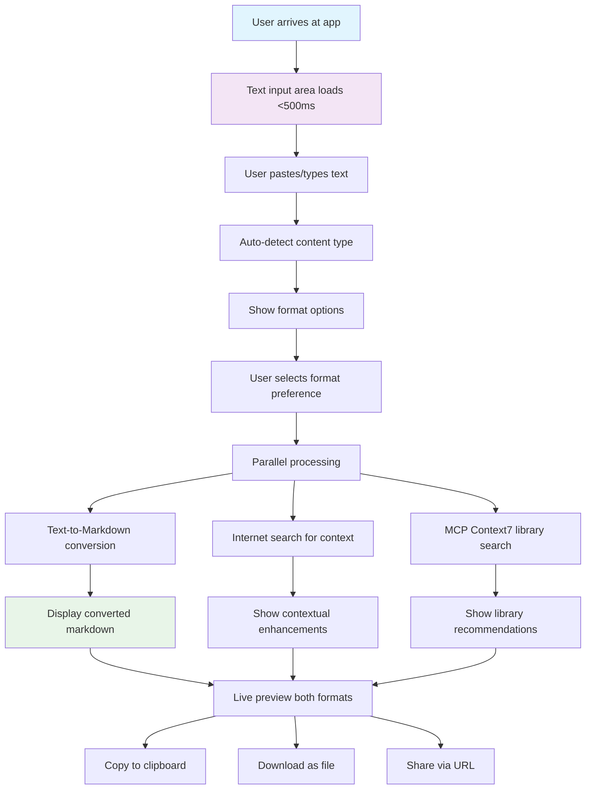
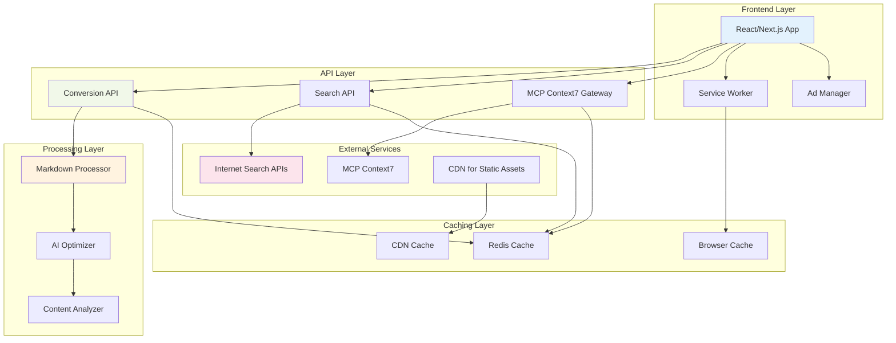
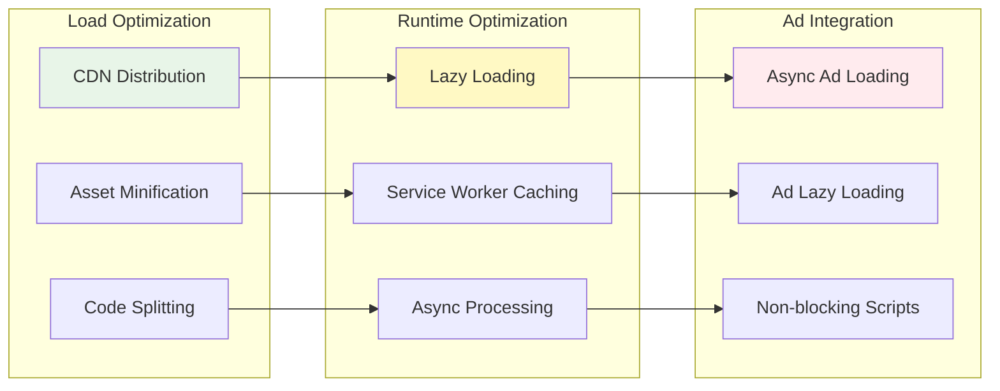
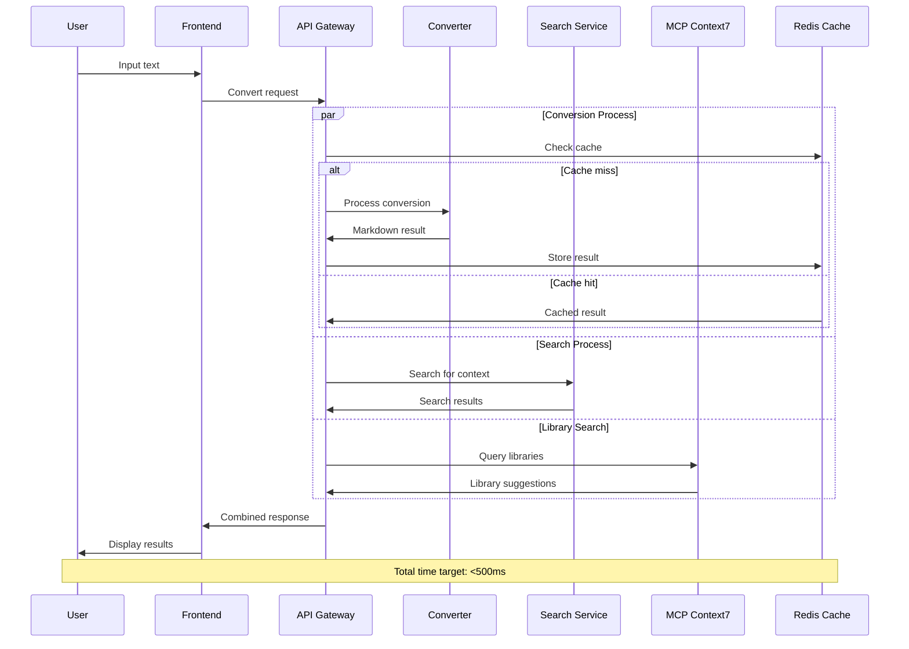
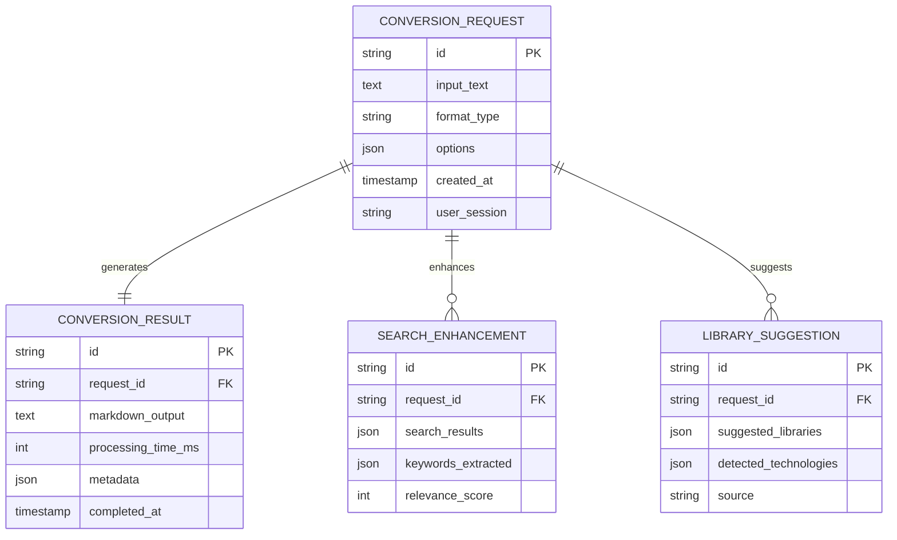
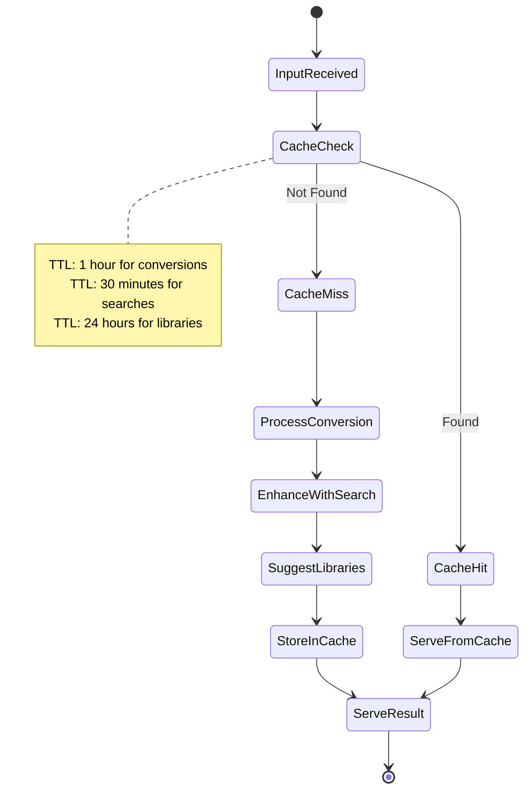

# AI Text-to-Markdown Converter Application - Product Requirements Document

## 1. Executive Summary

### Vision
A lightning-fast web application that converts plain text to optimized markdown formats, specifically designed to solve modern AI prompt engineering challenges while maintaining high-performance ad serving capabilities.

### Mission
Enable AI researchers, developers, and content creators to seamlessly convert text content into AI-optimized markdown formats with real-time internet research integration and library discovery through MCP Context7.

### Success Criteria
- Sub-500ms initial page load time
- 99.9% conversion accuracy for standard text formats
- Seamless ad integration without performance degradation
- Real-time internet search and library integration
- Support for multiple markdown variants

## 2. Problem & Solution

### The Problem
Modern AI prompt engineering faces several critical challenges:
- **Inconsistent Formatting**: Plain text lacks the structured formatting that AI models respond to optimally
- **Token Inefficiency**: Unformatted text wastes tokens and reduces AI performance
- **Research Friction**: Manual research for context and libraries slows development
- **Format Fragmentation**: Different AI tools prefer different markdown variants
- **Performance vs Revenue**: Traditional web apps sacrifice speed for ad revenue

### The Solution
A specialized web application that:
- Converts text to AI-optimized markdown formats instantly
- Integrates real-time internet search for context enhancement
- Leverages MCP Context7 for intelligent library recommendations
- Provides format options (Standard Markdown vs Extended/GFM)
- Maintains sub-500ms load times while serving ads effectively

### Market Opportunity
Based on research findings:
- 66.7% of websites fail to meet optimal loading standards
- AI prompt engineering market growing rapidly in 2025
- Existing tools lack AI optimization focus
- Microsoft's MarkItDown shows market validation for conversion tools

## 3. User Stories & Flows

### Epic 1: Core Text Conversion

#### Story 1.1: Quick Text Conversion
**As an** AI researcher  
**I want** to paste plain text and get optimized markdown instantly  
**So that** I can improve my prompt performance without manual formatting  

**Acceptance Criteria:**
- [ ] Text input supports up to 50KB of content
- [ ] Conversion completes in under 200ms
- [ ] Output preserves original meaning and structure
- [ ] Copy-to-clipboard functionality available

#### Story 1.2: Format Selection
**As a** developer working with different AI tools  
**I want** to choose between markdown formats  
**So that** I can optimize for specific AI models  

**Acceptance Criteria:**
- [ ] Toggle between Standard Markdown and GitHub Flavored Markdown
- [ ] Live preview of both formats
- [ ] Format differences clearly highlighted
- [ ] Default selection remembers user preference

### Epic 2: Enhanced Intelligence Features

#### Story 2.1: Internet Research Integration
**As a** content creator  
**I want** automatic context research for my text  
**So that** I can enhance my content with relevant information  

**Acceptance Criteria:**
- [ ] Automatic keyword detection from input text
- [ ] Real-time web search for related context
- [ ] Contextual suggestions integrated into markdown output
- [ ] Search results properly cited and linked

#### Story 2.2: Library Discovery
**As a** developer  
**I want** relevant code libraries suggested based on my text  
**So that** I can quickly find tools for implementation  

**Acceptance Criteria:**
- [ ] MCP Context7 integration for library search
- [ ] Technology stack detection from text
- [ ] Library recommendations with descriptions
- [ ] Direct links to documentation and repositories

### User Flow Diagram



## 4. Technical Architecture

### System Architecture Overview



### Performance Architecture



### Data Flow Sequence



## 5. API Specifications

### Core Conversion API

```javascript
// POST /api/convert
{
  "text": "string (required, max 50KB)",
  "format": "standard" | "gfm" | "commonmark",
  "options": {
    "enhanceWithSearch": boolean,
    "includLibraries": boolean,
    "preserveFormatting": boolean
  }
}

// Response
{
  "success": true,
  "data": {
    "markdown": "converted markdown string",
    "originalLength": number,
    "markdownLength": number,
    "tokenEstimate": number,
    "processingTime": number,
    "enhancements": {
      "searchResults": [...],
      "libraryRecommendations": [...]
    }
  },
  "metadata": {
    "format": "string",
    "timestamp": "ISO date",
    "cacheKey": "string"
  }
}
```

### Search Integration API

```javascript
// POST /api/search/enhance
{
  "text": "string (required)",
  "keywords": ["extracted", "keywords"],
  "maxResults": number (default: 5)
}

// Response
{
  "searchResults": [
    {
      "title": "string",
      "url": "string",
      "snippet": "string",
      "relevanceScore": number,
      "suggestedIntegration": "string"
    }
  ],
  "processingTime": number
}
```

### MCP Context7 Integration API

```javascript
// POST /api/libraries/suggest
{
  "text": "string (required)",
  "detectedTechnologies": ["react", "python", "etc"],
  "context": "string (optional)"
}

// Response
{
  "libraries": [
    {
      "name": "string",
      "description": "string",
      "repository": "string",
      "documentation": "string",
      "relevanceScore": number,
      "installCommand": "string"
    }
  ],
  "processingTime": number
}
```

## 6. Data Models

### Text Processing Model



### Caching Strategy Model



## 7. Implementation Phases

### Phase 1: Core MVP (Weeks 1-2)
**Goal**: Basic text-to-markdown conversion with format selection

**Features**:
- [ ] Basic React/Next.js application setup
- [ ] Text input with 50KB limit
- [ ] Standard Markdown conversion
- [ ] GitHub Flavored Markdown conversion
- [ ] Format toggle functionality
- [ ] Copy-to-clipboard feature
- [ ] Basic responsive design

**Technical Tasks**:
- [ ] Set up Next.js with TypeScript
- [ ] Implement markdown conversion library
- [ ] Create conversion API endpoints
- [ ] Add input validation and sanitization
- [ ] Implement basic error handling

**Success Criteria**:
- [ ] Conversion accuracy >95%
- [ ] Page load time <1 second
- [ ] Mobile responsive

### Phase 2: Performance Optimization (Weeks 3-4)
**Goal**: Achieve sub-500ms load times and ad integration

**Features**:
- [ ] Service Worker implementation
- [ ] Advanced caching strategies
- [ ] CDN integration
- [ ] Async ad loading system
- [ ] Code splitting and lazy loading

**Technical Tasks**:
- [ ] Implement Redis caching layer
- [ ] Set up CDN (Cloudflare/AWS CloudFront)
- [ ] Add service worker for offline capability
- [ ] Optimize bundle size and splitting
- [ ] Implement lazy loading for non-critical components
- [ ] Add performance monitoring

**Success Criteria**:
- [ ] Initial load time <500ms
- [ ] Subsequent loads <200ms
- [ ] Ads load without blocking main content
- [ ] 90+ Lighthouse performance score

### Phase 3: Intelligence Features (Weeks 5-6)
**Goal**: Internet search and MCP Context7 integration

**Features**:
- [ ] Real-time internet search integration
- [ ] MCP Context7 library suggestions
- [ ] Contextual enhancement of markdown
- [ ] Technology stack detection
- [ ] Intelligent keyword extraction

**Technical Tasks**:
- [ ] Integrate web search APIs (Google/Bing)
- [ ] Set up MCP Context7 connection
- [ ] Implement keyword extraction algorithms
- [ ] Create enhancement suggestion system
- [ ] Add contextual markdown injection
- [ ] Implement rate limiting for external APIs

**Success Criteria**:
- [ ] Search results relevant >80% of time
- [ ] Library suggestions accurate >85% of time
- [ ] Enhancement processing <300ms additional
- [ ] No impact on core conversion performance

### Phase 4: Advanced Features (Weeks 7-8)
**Goal**: Enhanced user experience and productivity features

**Features**:
- [ ] File upload support (PDF, DOC, TXT)
- [ ] Batch conversion capability
- [ ] URL-based sharing
- [ ] Download options (MD, HTML, PDF)
- [ ] User preferences and history
- [ ] Advanced markdown formatting options

**Technical Tasks**:
- [ ] Implement file parsing (PDF, DOC)
- [ ] Add batch processing queue
- [ ] Create shareable URL system
- [ ] Implement export functionality
- [ ] Add user session management
- [ ] Create advanced formatting options

**Success Criteria**:
- [ ] Support for 5+ file formats
- [ ] Batch processing of up to 10 files
- [ ] Export quality matches input quality
- [ ] User preferences persist across sessions

## 8. Risk Assessment & Mitigations

### Technical Risks

| Risk | Impact | Probability | Mitigation Strategy |
|------|---------|-------------|-------------------|
| API Rate Limiting | High | Medium | Implement caching, multiple API providers, graceful degradation |
| Performance Degradation | High | Medium | Comprehensive monitoring, performance budgets, CDN optimization |
| MCP Context7 Downtime | Medium | Low | Fallback to cached results, alternative library sources |
| Search API Costs | Medium | High | Implement smart caching, result deduplication, cost monitoring |
| Security Vulnerabilities | High | Low | Input sanitization, CSP headers, regular security audits |

### Business Risks

| Risk | Impact | Probability | Mitigation Strategy |
|------|---------|-------------|-------------------|
| Ad Revenue vs Performance | Medium | High | A/B testing, performance-first ad loading, ad optimization |
| Market Competition | Medium | Medium | Focus on AI optimization niche, unique MCP integration |
| User Adoption | High | Medium | Strong onboarding, clear value proposition, performance benefits |
| Technology Obsolescence | Low | Low | Modern tech stack, regular updates, modular architecture |

## 9. Success Metrics & KPIs

### Performance Metrics
- **Page Load Time**: Target <500ms (P95)
- **Conversion Speed**: Target <200ms (P95)
- **API Response Time**: Target <100ms (P95)
- **Lighthouse Score**: Target >90
- **Core Web Vitals**: All metrics in "Good" range
- **Uptime**: Target 99.9%

### User Experience Metrics
- **Conversion Accuracy**: Target >98%
- **User Satisfaction**: Target >4.5/5
- **Task Completion Rate**: Target >95%
- **Time to First Conversion**: Target <30 seconds
- **Return User Rate**: Target >60%

### Business Metrics
- **Daily Active Users**: Growth target 20% MoM
- **Ad Revenue Per User**: Target $0.10+ per session
- **Cost Per Conversion**: Target <$0.05
- **API Cost Efficiency**: Target <$0.02 per conversion
- **User Retention**: Target >70% at 7 days

### Technical Metrics
- **Error Rate**: Target <0.1%
- **Cache Hit Rate**: Target >80%
- **API Success Rate**: Target >99.5%
- **Security Incidents**: Target 0
- **Performance Regression**: Target 0

## 10. Technical Specifications

### Frontend Stack
- **Framework**: Next.js 14+ with App Router
- **Language**: TypeScript
- **Styling**: Tailwind CSS with custom performance optimizations
- **State Management**: Zustand for lightweight state management
- **HTTP Client**: Fetch API with custom retry logic
- **Bundle Analyzer**: webpack-bundle-analyzer for optimization

### Backend Stack
- **Runtime**: Node.js 20+ LTS
- **Framework**: Next.js API Routes / Fastify for high performance
- **Language**: TypeScript
- **Caching**: Redis 7+ for distributed caching
- **Queue**: Bull Queue for background processing
- **Monitoring**: DataDog or New Relic for APM

### Infrastructure
- **Hosting**: Vercel (optimal for Next.js) or AWS/GCP
- **CDN**: Cloudflare for global distribution
- **Database**: PostgreSQL for metadata, Redis for caching
- **File Storage**: AWS S3 or similar for uploaded files
- **SSL**: Automatic HTTPS with certificate management

### Third-Party Integrations
- **Search APIs**: Google Custom Search, Bing Web Search
- **MCP**: Context7 integration via HTTP transport
- **Ad Networks**: Google AdSense, appropriate ad networks
- **Analytics**: Google Analytics 4, custom event tracking
- **Error Tracking**: Sentry for error monitoring

## 11. Security & Compliance

### Security Measures
- **Input Sanitization**: All text inputs sanitized against XSS
- **Rate Limiting**: API endpoints protected against abuse
- **CORS Policy**: Restrictive CORS configuration
- **CSP Headers**: Content Security Policy for XSS protection  
- **HTTPS Only**: All traffic encrypted in transit
- **Dependency Scanning**: Regular security audits of dependencies

### Privacy Considerations
- **Data Retention**: Conversion history stored for 30 days maximum
- **User Tracking**: Minimal tracking, respect for user privacy
- **Cookie Policy**: Essential cookies only, clear consent
- **Data Encryption**: Sensitive data encrypted at rest
- **GDPR Compliance**: EU privacy regulation compliance

## 12. Deployment & DevOps

### CI/CD Pipeline


### Environment Strategy
- **Development**: Local development with hot reload
- **Staging**: Production-like environment for testing
- **Production**: High-availability production deployment
- **Testing**: Isolated environment for automated tests

### Monitoring & Alerting
- **Application Performance**: Response times, error rates
- **Infrastructure**: Server resources, database performance
- **User Experience**: Real user monitoring, core web vitals
- **Business Metrics**: Conversion rates, user engagement
- **Security**: Intrusion detection, vulnerability scanning

## Conclusion

This PRD outlines a comprehensive plan for building a high-performance, AI-optimized text-to-markdown conversion application. The phased approach ensures rapid time-to-market while building toward a feature-rich, performant solution that balances user experience with monetization through strategic ad integration.

The technical architecture prioritizes performance while maintaining flexibility for future enhancements. The integration of internet search and MCP Context7 provides unique value proposition in the growing AI prompt engineering market.

**Next Steps**: Please review this PRD and provide feedback on:
1. Target user personas confirmation
2. Markdown format preferences (Standard vs GFM vs custom)
3. Budget and timeline constraints
4. Any additional technical requirements or integrations needed

This PRD is ready for conversion into implementation PRPs once approved.